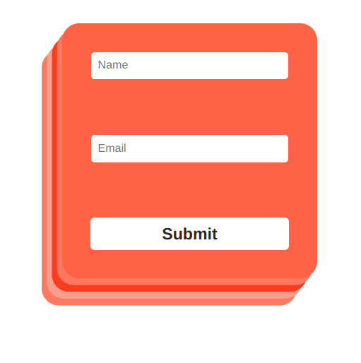

# **Exercice Formulaire**

### - Réalisation d'une base de données SQLite à l'aide de l'ORM PRISMA 
### - Serveur NodeJS/ExpressJS
### - Formulaire FrontEnd réalisé avec React

## =============================================

## **INSTALLATION** (npm requis)

### Premièrement, il faut cloner le repo contenant notre backend : 
> gh repo clone 8astien/form-exercice

[(Lien du repo backend)](https://github.com/8astien/form-exercice)

### Lancez la commande suivante pour installer les modules nécessaires
> npm install

---
### Ensuite, cloner le repo frontend
### Le répertoire de destination n'a pas d'importance 

> gh repo clone 8astien/form-exercice-front

[(Lien du repo front)](https://github.com/8astien/form-exercice-front)

### Se placer dans le répertoire front et lancer l'installation des modules

> npm install

---
---
# **Lancement du serveur**

### Se placer dans le répertoire backend

> npx nodemon index.ts

### nodemon nous permettra de rafraichir dynamiquement le serveur

### A partir de ce moment, nos routes sont actives ! 

---
---
# **Lancement du frontend**
### Se placer dans le répertoire frontend
> npm start

#### Note : Notre serveur de développement React se lance (sur le port 3001 étant donné que notre serveur ExpressJS tourne sur le port 3000)_

### Vous pouvez accéder au formulaire sur : **localhost:3001/**

---

## Entrez un nom d'utilisateur et un email (doit être syntaxiquement correct)   

### Le nom de votre utilisateur et son adresse email sont maintenant présents dans la DataBase ! 

---
---

### Réalisé en coopération avec **[Valentin Deal-Collet](https://github.com/Clawyer)**